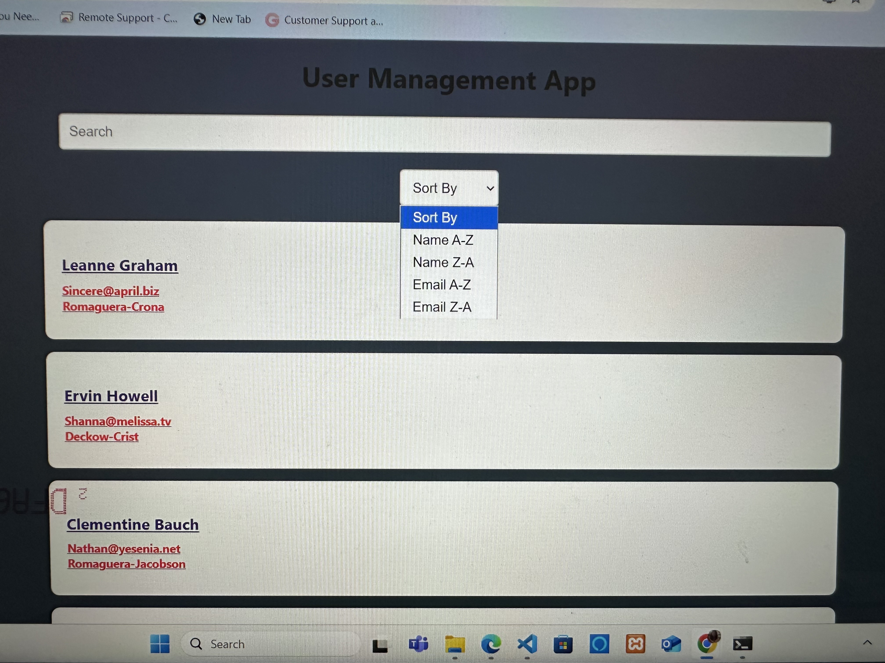
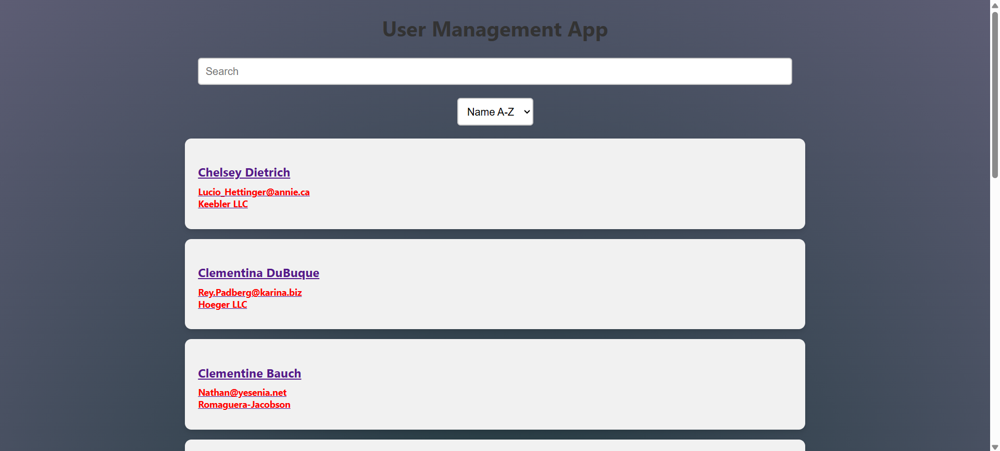
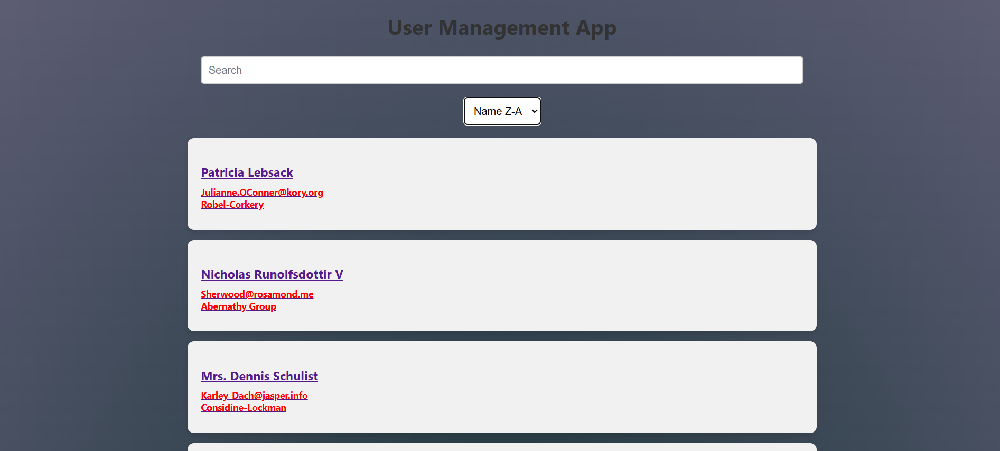

# User Management App
A simple React app for managing users-app to demonstrate components, state, routing, forms and data 
fetching.

## How to run the App

1. ** You need Node.js and npm installed**
2. ** Clone the repository and navigate to the project folder for example mine is: cd C:\Users\feba\OneDrive\Desktop\react-app\user-management-app **
3. **Install dependencies: npm install **
4. ** Start the development server: npm start **
5. ** Open your browser and go to http://localhost:3000/ to use the app **

## Features

- Search users by **name or email ** 
- View detailed user info
- Add new users (stored locally)
- Sort by name or email (A-Z or Z-A)
- Styled with clean and responsive UI

## Assets(photos of the app)

### Home Page (Main Page)

 Here you can see there is the search bar in which you can search by name and email and all the users with that name or email will show up 
 
The Sort By dropdown component is used to sort the list of users by Name or Email in (A-Z) or (Z-A)
 

Here you can see the sorting of user list by name in version A-Z

And here is the sorting of user list by name in version Z-A, same goes for sorting with email too.

