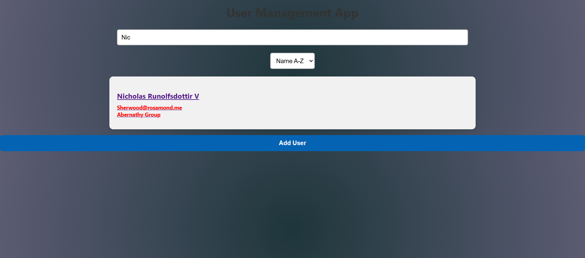

# User Management App
A simple React app for managing users-app to demonstrate components, state, routing, forms and data 
fetching.

## How to run the App

1. ** You need Node.js and npm installed**
2. ** Clone the repository and navigate to the project folder for example mine is: cd C:\Users\feba\OneDrive\Desktop\react-app\user-management-app **
3. **Install dependencies: npm install **
4. ** Start the development server: npm start **
5. ** Open your browser and go to http://localhost:3000/ to use the app **

## Features

- Search users by **name or email ** 
- View detailed user info
- Add new users (stored locally)
- Sort by name or email (A-Z or Z-A)
- Styled with clean and responsive UI

## Assets(photos of the app)

### Home Page (Main Page)

 Here you can see there is the search bar in which you can search by name and email and all the users with that name or email will show up 
 
For example if we search "Nic" only one user shows up

 
The Sort By dropdown component is used to sort the list of users by Name or Email in (A-Z) or (Z-A)
 

Here you can see the sorting of user list by name in version A-Z

And here is the sorting of user list by name in version Z-A, same goes for sorting with email too.

In the end of the User List, there is the button "Add User" to add User locally. 

If you click on the button Add User a form will show up 

In this form Username, Email and Company are required as you can see in the other photo down

 
 Besides being required, there is a regex to check if the written email is valid (see in the picture down)
 

So all three fields should be fullfilled and the email should be in a valid form 
 
 And then successfully the user will be added

View detailed user info
You can click on any User that you want to see more details about them

And then Use "Back to Home" Button to get back to homepage

